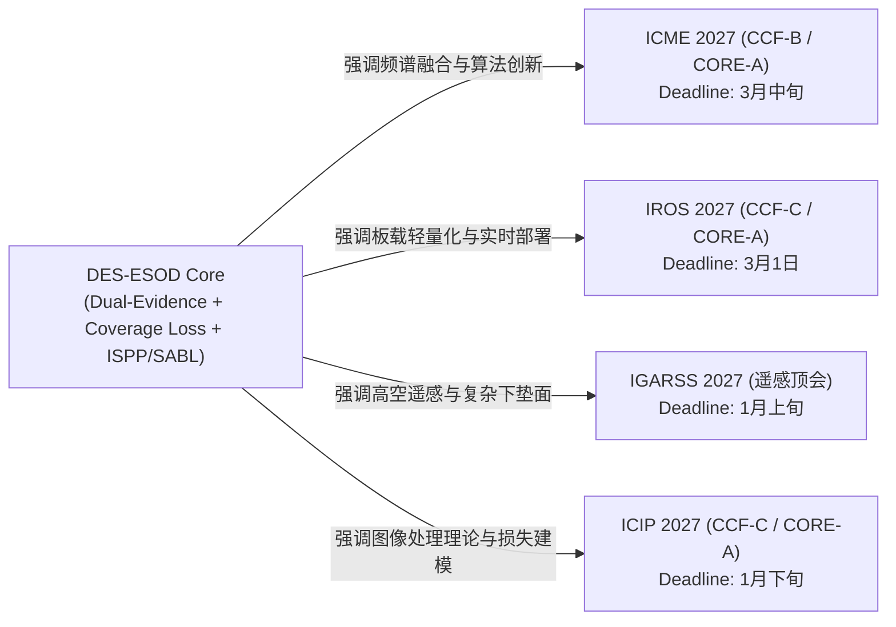

# 论文投稿目标规划 (Target Conferences Roadmap)

> **研究方向**：高分辨率图像微小目标检测 (Small Object Detection)、空间条件/选择性计算 (Selective Computation)、无人机与遥感边缘感知 (UAV & Remote Sensing Perception)  
> **论文成果**：DES-ESOD (Dual-Evidence Selection and Coverage Optimization)

---

## 1. 核心目标会议一览表

| 会议简称 | 会议全称 / 主办 | CCF分类 | CORE评级 | 预计截稿时间 (2027年) | 核心契合点与方向特点 | 推荐投稿侧重点 |
|:---|:---|:---:|:---:|:---:|:---|:---|
| **ICME 2027** | IEEE International Conference on Multimedia and Expo | **CCF-B** | **CORE-A** | **3月中旬左右** | **多媒体/视觉方向极力推荐**。包含大量无人机目标检测、轻量化网络、视频小目标跟踪等工作，对小目标检测算法创新极其友好。 | 突出**双证据融合机制**（语义特征与浅层高频频谱特征结合），强调算法在航拍多媒体与复杂视觉流中的高效感知创新。 |
| **IROS 2027** | IEEE/RSJ International Conference on Intelligent Robots and Systems | **CCF-C** | **CORE-A** | **3月1日** | **无人机机器人应用方向极力推荐**。偏向无人机（UAV）平台搭载视觉算法的落地应用。非常看重算法在无人机、自主导航上的工程/落地/轻量化与实时性。 | 突出**端侧边缘部署与能耗节省**（Edge Deployment），强调空间选择性计算减少 50%+ 算力对无人机板载算力及续航的实际赋能。 |
| **IGARSS 2027** | IEEE International Geoscience and Remote Sensing Symposium (IEEE GRSS) | **遥感顶会** | **遥感旗舰** | **1月上旬左右** | **遥感检测方向首选**。IEEE GRSS 旗舰盛会，在遥感领域认可度极高（常享有一区/顶级影响力）。无人机图像天然属于高空低空遥感，小目标检测（车辆、海面搜救行人、航拍船只、农作物）是其经典核心主题。 | 突出**超高分辨率全画幅遥感感知**（如 $2048\times 2048$ 不切图），强调复杂海陆下垫面背景下的微小目标高召回与覆盖安全性。 |
| **ICIP 2027** | IEEE International Conference on Image Processing (IEEE SPS) | **CCF-C** | **CORE-A** | **1月下旬左右** | **图像处理领域经典盛会**。ICIP 2027 将在新加坡举行。图像处理与信号处理标准顶级会议。 | 突出**频域/梯度滤波理论建模**（Channel-Pooled Spectral Branch）以及**软覆盖率损失函数 ($\mathcal{L}_{\mathrm{cover}}$)** 的数学推导与理论完整性。 |

---

## 2. 各会议定位与论文叙事调整策略 (Submission Strategy)

### 2.1 ICME 2027 (多媒体大顶会)
- **审稿偏好**：注重视觉算法创新的有效性与完备性，关注多模态/多特征融合及多媒体流应用。
- **论文调整建议**：
  - 引言与方法部分强化**“语义特征”与“频域高频结构特征”的互补性机制**；
  - 重点展示 SeaPerson 与 UAVDT 上的尺寸分桶增益（尤其是 Tiny/Very Tiny 目标的显著召回跃升）。

### 2.2 IROS 2027 (机器人旗舰会)
- **审稿偏好**：极度看重无人机（UAV）、自主移动机器人（AMR）的机载闭环落地价值与实时延迟（Latency）。
- **论文调整建议**：
  - 强化“边缘计算平台（如 Jetson Orin / Xavier）实际推理延迟、FPS 与显存占用”实验；
  - 强调非对称误删代价在无人机自主搜救（Search-and-Rescue）中的致命性，突出 Soft-Coverage 的“召回安全保障（Recall Safety）”。

### 2.3 IGARSS 2027 (遥感旗舰会)
- **审稿偏好**：关注地球科学、低空航拍遥感、海洋监测与特定地物（如微小行人、车辆、浮标）解译。
- **论文调整建议**：
  - 突出无需切图切片（Without Pre-tiling）直接在 $2048\times 2048$ 甚至更高分辨率遥感全景图上的高通量检测能力；
  - 增加海面杂波（Sea clutter）、光照反光与开阔荒野场景的定性可视化对比。

### 2.4 ICIP 2027 (图像处理经典盛会)
- **审稿偏好**：偏好清晰优雅的图像处理算子设计、损失函数数学形式化与信号/特征分析。
- **论文调整建议**：
  - 保持目前 IEEE ICIP 4+1 页的严密数学表述（Laplacian/Sobel 算子形式化、Wasserstein 距离与 Soft-Coverage 概率推导）。

---

## 3. 投稿准备时间线与行动路线 (Timeline)

- **2026年 11月 - 12月**：
  - 完善补充多 GPU / 边缘端（Jetson）FPS 与算力能耗测试；
  - 准备 IGARSS 2027 与 ICIP 2027 的第一批次投稿稿件。
- **2027年 1月**：
  - **1月上旬**：完成 **IGARSS 2027** 投稿提交；
  - **1月下旬**：完成 **ICIP 2027** 投稿提交。
- **2027年 2月 - 3月**：
  - 根据实验补充与针对性包装（机器人应用 vs. 多媒体视觉算法）；
  - **3月1日**：完成 **IROS 2027** 投稿提交；
  - **3月中旬**：完成 **ICME 2027** 投稿提交。
